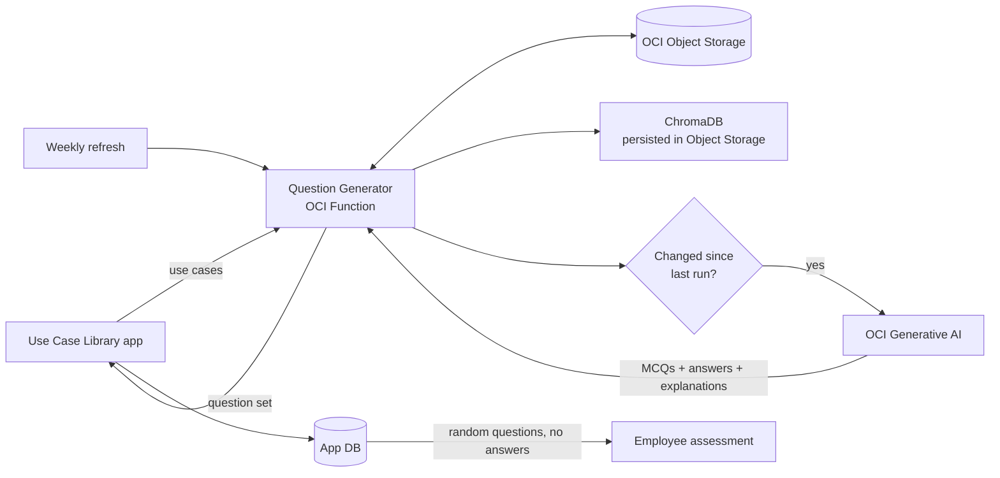

# AI Use Case Assessment on OCI

> **Sanitized ACE project package.** OCIDs, Object Storage namespace and bucket, region, and endpoints are replaced with placeholders. Sample use cases are generic ERP scenarios with no client data. No credentials are included.

## Overview

Implementation teams document ERP know-how as **use cases**: a business requirement plus its external and internal configuration, organised by pillar (HCM, Finance, SCM, Manufacturing), module, and process. Checking that consultants and employees understand those use cases has meant writing quiz questions by hand, and they go stale whenever a use case changes.

This project uses an **OCI Function backed by OCI Generative AI** to turn the use case library into knowledge assessments automatically. For every new or changed use case, the function generates multiple-choice questions with the correct answer and an explanation. It stores them in OCI Object Storage and returns them to the Use Case Library application. The application serves randomised questions to employees, hides the answers, and grades submissions against its own stored answer key.

## Architecture

The full diagram is in [architecture.mmd](architecture.mmd).



## How it works

1. **Trigger.** The application calls the function when use cases are published or when a user clicks *Take Assessment*. A weekly scheduled invoke refreshes the whole library.
2. **Index.** Use cases are upserted into a **ChromaDB** collection (cosine similarity). The store is persisted as a zip in Object Storage between invocations, ready for a future RAG chatbot over the same library.
3. **Delta detection.** An MD5 checksum of each use case's business and configuration text is compared with `usecase_meta.json`. Only new or changed use cases go to the model, which keeps Generative AI cost and latency down.
4. **Generate.** For each changed use case, **OCI Generative AI (Cohere Command R+)** gets a structured prompt and returns exactly *N* questions (default 5). Each has four options, one correct answer, and a 2–3 sentence explanation, all as strict JSON.
5. **Persist.** Questions are written to `UseCase_AI/questions/<pillar>/<module>/<process>/<case_id>.json`, and the delta metadata is updated.
6. **Serve.** The full set, including answers and explanations, is returned to the application API and saved in its database. A PL/SQL procedure serves randomised questions and options only. On submission, the app grades answers against its stored key and shows explanations, so no second function call is needed.

Model failures are isolated per use case: one bad response doesn't stop the rest of the batch.

## Evidence

| File | Shows |
| --- | --- |
| [01-knowledge-assessments-dashboard.png](evidence/01-knowledge-assessments-dashboard.png) | Knowledge Assessments screen with AI-generated assessments across HCM, Finance, SCM, and Manufacturing modules |
| [02-unit-tests-passing.png](evidence/02-unit-tests-passing.png) | 10 offline unit tests passing (delta detection, GenAI response parsing, storage layout, handler flow) |

## Repository layout

```text
AI Use Case Assessment/
├── README.md
├── architecture.mmd
├── .gitignore
├── docs/
│   ├── ACE_SUBMISSION.md
│   └── EVIDENCE_CHECKLIST.md
├── sanitized-source/
│   ├── README.md
│   └── usecase-question-generator/
│       ├── func.py
│       ├── func.yaml
│       └── requirements.txt
├── samples/
│   └── usecase-payload.json        synthetic HCM Recruiting use cases (5)
├── tests/
│   └── test_question_generator.py  offline tests with stubbed OCI SDK and ChromaDB
├── tools/
│   └── render_evidence.py          regenerates the test evidence image
└── evidence/
    ├── README.md
    ├── 01-knowledge-assessments-dashboard.png
    └── 02-unit-tests-passing.png
```

## Invoking the function

```bash
# Return the built-in sample payload
echo '{"mode": "sample_data"}' | fn invoke <app-name> usecase-ai-question-generator

# Generate questions for new/changed use cases
fn invoke <app-name> usecase-ai-question-generator < samples/usecase-payload.json
```

Response (abridged):

```json
{
  "status": "success",
  "pillar": "HCM",
  "module": "Recruiting",
  "triggered_by": "weekly_refresh",
  "total_usecases_processed": 5,
  "results": [
    {
      "case_id": "UC-REC-001-01",
      "title": "Create Job Requisition",
      "questions_generated": 5,
      "object_key": "UseCase_AI/questions/HCM/Recruiting/PROC-REC-001/UC-REC-001-01.json",
      "questions": [ { "question": "...", "options": {"A": "...", "B": "...", "C": "...", "D": "..."},
                       "correct_option": "B", "explanation": "..." } ]
    }
  ]
}
```

A second run with unchanged content returns `"status": "up_to_date"` and makes no model calls.

## Configuration

| Variable | Purpose |
| --- | --- |
| `OCI_NAMESPACE`, `OCI_BUCKET` | Object Storage location for the ChromaDB store, questions, and metadata |
| `OCI_COMPARTMENT_ID` | Compartment for Generative AI calls |
| `OCI_GENAI_ENDPOINT` | Regional Generative AI inference endpoint |
| `OCI_GENAI_MODEL_ID` | Model OCID or name (default `cohere.command-r-plus`) |
| `QUESTIONS_PER_CASE` | Questions per use case (default 5) |

The function authenticates with **resource principals**. Grant its dynamic group `use generative-ai-family` in the compartment, and `manage objects` restricted to the target bucket.

## Run the tests

```bash
python -m unittest discover -s tests -v
```

The tests use only the standard library. They stub the OCI SDK, FDK, and ChromaDB, so no cloud access is required.

## OCI services used

| Service | Role |
| --- | --- |
| OCI Functions | Serverless question generator, invoked by the app or on a weekly schedule |
| OCI Generative AI | Cohere Command R+ generates questions, answers, and explanations |
| OCI Object Storage | Persisted ChromaDB store, generated question sets, delta metadata |
| OCI IAM | Resource principal authentication with least-privilege policies |
| OCI Logging | Invocation diagnostics |

## Author contribution

I designed and built the AI use case assessment workflow. This covers the OCI Function that indexes the ERP use case library in ChromaDB, checksum-based delta detection, prompt design and JSON-validated question generation with OCI Generative AI, Object Storage persistence, and the integration contract that lets the application serve randomised assessments while keeping the answer key server-side.
